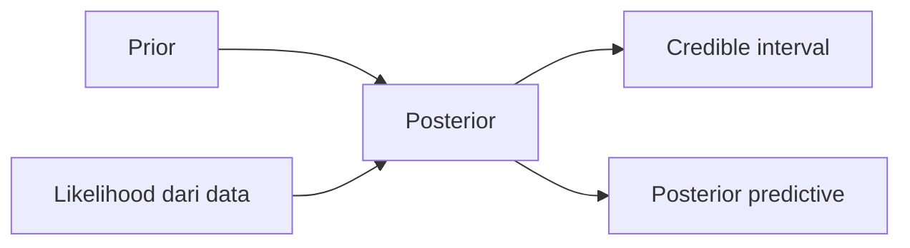
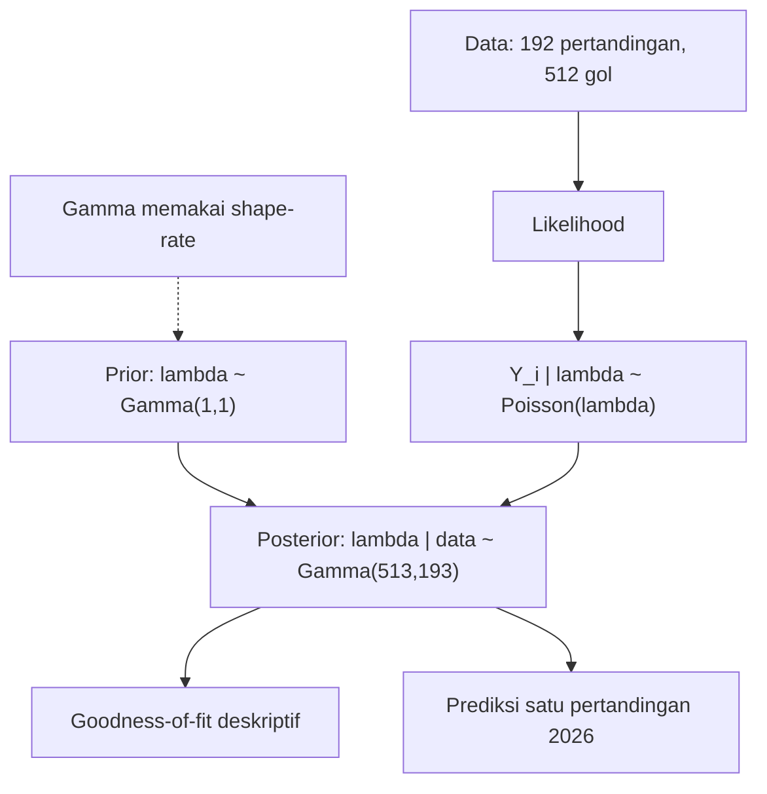

# Model Bayesian Poisson untuk Gol Piala Dunia

Posisi materi:

> Materi ini melanjutkan draft teman sebagai dasar riset, lalu merapikannya menjadi studi kasus Bayesian Poisson untuk jumlah gol Piala Dunia.

Tujuan utama:

> Menjelaskan inferensi Bayesian untuk data hitungan, bukan membuat sistem prediksi sepak bola yang kompleks.

Gambar yang disarankan: `slides/assets/bayesian_poisson_flow.png`

---

# Peta Cerita

Alur presentasi:

1. Apa itu data hitungan?
2. Apa itu distribusi Poisson?
3. Apa itu inferensi Bayes?
4. Mengapa prior Gamma dipakai?
5. Apa yang dilakukan pada data Piala Dunia?
6. Apa hasil posterior dan prediksi 2026?


---

# Motivasi

Gol sepak bola adalah data hitungan:

- 0 gol
- 1 gol
- 2 gol
- 3 gol
- dan seterusnya

Karena nilainya berupa bilangan bulat tidak negatif, distribusi Poisson cocok sebagai model awal.

Dataset Piala Dunia memberi contoh nyata untuk menjelaskan konsep matematisnya.

---

# Apa Itu Poisson?

Poisson adalah distribusi peluang untuk menghitung banyaknya kejadian dalam satu interval tetap.

Contoh umum:

- jumlah panggilan masuk per jam
- jumlah kecelakaan per hari
- jumlah cacat produksi per batch
- jumlah pelanggan datang ke loket
- jumlah gol dalam satu pertandingan

Intinya:

```text
Poisson memodelkan jumlah kejadian.
Parameter utamanya adalah lambda.
lambda = rata-rata kejadian dalam satu interval.
```

---

# Kapan Poisson Cocok?

Poisson cocok ketika:

- data berupa hitungan: 0, 1, 2, 3, ...
- interval observasi jelas, misalnya satu pertandingan
- kita ingin memodelkan rata-rata kejadian
- nilai negatif tidak mungkin muncul

Dalam tugas ini:

```text
kejadian = gol
interval = satu pertandingan Piala Dunia
variabel = total gol dalam satu pertandingan
```

---

# Formula Poisson

Jika `Y` adalah total gol dalam satu pertandingan:

```text
Y ~ Poisson(lambda)
```

Peluang tepat `y` gol:

```text
P(Y = y | lambda) = exp(-lambda) * lambda^y / y!
```

Keterangan:

- `y` = jumlah gol yang diamati
- `lambda` = rata-rata gol per pertandingan
- `lambda > 0`

Jika `lambda` besar, pertandingan dengan banyak gol menjadi lebih mungkin.

---

# Contoh Manual Poisson

Misalkan rata-rata gol yang diasumsikan:

```text
lambda = 2
```

Pertanyaan:

> Berapa peluang satu pertandingan menghasilkan tepat 3 gol?

Gunakan rumus:

```text
P(Y = 3 | lambda = 2)
= exp(-2) * 2^3 / 3!
```

Hitung bertahap:

```text
exp(-2) ~= 0.1353
2^3 = 8
3! = 6

P(Y = 3) ~= (0.1353 * 8) / 6
P(Y = 3) ~= 0.1804
```

Artinya: peluang tepat 3 gol sekitar 18.04%.

---

# Apa Itu Bayes?

Bayes adalah cara memperbarui keyakinan setelah melihat data.

Komponen utamanya:

- prior: keyakinan awal sebelum melihat data
- likelihood: seberapa mungkin data terjadi untuk nilai parameter tertentu
- posterior: keyakinan baru setelah prior digabung dengan data

Intuisi:

```text
keyakinan awal + bukti dari data = keyakinan setelah melihat data
```

Bayes bukan hanya untuk klasifikasi. Dalam statistik, Bayes juga dipakai untuk mengestimasi parameter dan menyatakan ketidakpastian.

---

# Alur Bayes



Makna alur:

- prior memberi informasi awal
- likelihood membawa informasi dari data
- posterior adalah hasil pembaruan
- posterior dipakai untuk interval dan prediksi

---

# Formula Bayes

Formula umum:

```text
P(theta | data) = P(data | theta) * P(theta) / P(data)
```

Untuk tugas ini:

```text
P(lambda | data) proportional to P(data | lambda) * P(lambda)
```

Bahasa sederhananya:

```text
posterior = likelihood x prior
```

Yang ingin dicari bukan hanya satu angka `lambda`, tetapi distribusi kemungkinan untuk `lambda`.

---

# Contoh Manual Bayes Sederhana

Misalkan ada dua kemungkinan rata-rata gol:

```text
H1: lambda = 1
H2: lambda = 3
```

Sebelum melihat data:

```text
P(H1) = 0.5
P(H2) = 0.5
```

Kita mengamati satu pertandingan dengan 2 gol.

Likelihood Poisson:

```text
P(Y = 2 | lambda = 1) = 0.1839
P(Y = 2 | lambda = 3) = 0.2240
```

---

# Manual Bayes: Normalisasi

Skor posterior belum dinormalisasi:

```text
H1: 0.5 * 0.1839 = 0.0920
H2: 0.5 * 0.2240 = 0.1120
```

Total skor:

```text
0.0920 + 0.1120 = 0.2040
```

Posterior:

```text
P(H1 | Y = 2) = 0.0920 / 0.2040 = 0.451
P(H2 | Y = 2) = 0.1120 / 0.2040 = 0.549
```

Interpretasi:

> Setelah melihat 2 gol, `lambda = 3` menjadi sedikit lebih dipercaya daripada `lambda = 1`.

---

# Penggunaan Umum

Poisson biasanya dipakai untuk:

- memodelkan data hitungan
- memperkirakan rate atau intensitas kejadian
- memprediksi jumlah kejadian pada interval berikutnya

Bayes biasanya dipakai untuk:

- memperbarui probabilitas setelah ada data baru
- menggabungkan pengetahuan awal dan data observasi
- menghasilkan interval ketidakpastian
- membuat prediksi probabilistik

Gabungan Bayesian Poisson dipakai ketika data berbentuk hitungan dan parameter rata-ratanya masih tidak pasti.

---

# Apa yang Kita Lakukan?

Dalam tugas ini, kita tidak membuat klasifikasi benar/salah.

Yang dilakukan:

- ambil total gol setiap pertandingan
- anggap total gol mengikuti distribusi Poisson
- anggap rata-rata gol `lambda` belum diketahui
- beri prior Gamma untuk `lambda`
- perbarui prior dengan data 2014, 2018, dan 2022
- gunakan posterior untuk memprediksi satu pertandingan Piala Dunia 2026

Output utama adalah distribusi, bukan satu label prediksi.

---

# Alur Model Tugas



Diagram ini adalah alur yang sama dengan notebook.

---

# Mengapa Model Ini Cocok?

Model ini cocok untuk tugas Mathematical and Statistical Foundations karena:

- gol adalah data hitungan
- Poisson adalah model dasar untuk data hitungan
- `lambda` harus positif, sehingga prior Gamma cocok
- Gamma konjugat terhadap Poisson, sehingga posterior bisa dihitung rapi
- hasilnya menunjukkan prior, likelihood, posterior, dan prediktif posterior secara jelas

Batas penting:

> Model ini adalah model agregat. Ia menjelaskan rata-rata gol secara umum, bukan kekuatan masing-masing tim.

---

# Pertanyaan Penelitian

Pertanyaan utama:

> Bagaimana model Bayesian Poisson dapat digunakan untuk memodelkan jumlah gol dalam satu pertandingan Piala Dunia?

Pertanyaan lanjutan:

> Berdasarkan Piala Dunia 2014, 2018, dan 2022, seperti apa distribusi prediktif posterior untuk jumlah gol pada satu pertandingan Piala Dunia 2026?

---

# Distribusi Prior

Sebelum melihat data, kita memberi keyakinan awal terhadap `lambda`.

Karena `lambda` harus bernilai positif, prior yang dipakai adalah Gamma:

```text
lambda ~ Gamma(alpha, beta)
```

Keterangan:

- `alpha` = parameter shape
- `beta` = parameter rate
- rata-rata prior = `alpha / beta`

Catatan parameterisasi:

```text
Gamma(shape, rate)
```

Ini perlu disebutkan karena beberapa buku memakai parameter kedua sebagai `scale`, bukan `rate`.

Dalam tugas ini:

```text
lambda ~ Gamma(1, 1)
prior mean = 1 / 1 = 1
```

---

# Mengapa Prior Gamma?

Distribusi Gamma berguna karena:

- hanya menghasilkan nilai positif
- bentuknya fleksibel
- cocok untuk parameter rate seperti `lambda`
- konjugat terhadap likelihood Poisson

Konjugat berarti:

> Jika prior adalah Gamma dan likelihood adalah Poisson, maka posterior juga berbentuk Gamma.

Ini membuat perhitungan matematis bersih dan cocok untuk mata kuliah Mathematical and Statistical Foundations.

---

# Contoh Manual Gamma-Poisson

Misalkan contoh kecilnya hanya 3 pertandingan:

```text
Y = [2, 1, 4]
```

Ringkasan data:

```text
n = 3
sum(y_i) = 2 + 1 + 4 = 7
```

Prior:

```text
lambda ~ Gamma(1, 1)
```

Rumus posterior:

```text
lambda | data ~ Gamma(alpha + sum(y_i), beta + n)
```

---

# Manual Gamma-Poisson: Hasil

Substitusi:

```text
lambda | data ~ Gamma(1 + 7, 1 + 3)
lambda | data ~ Gamma(8, 4)
```

Rata-rata posterior:

```text
E[lambda | data] = 8 / 4 = 2
```

Makna:

- total gol masuk ke parameter `shape`
- jumlah pertandingan masuk ke parameter `rate`
- posterior mean menjadi estimasi rata-rata gol setelah data diamati

---

# Data yang Dipakai

Data utama mengikuti draft:

| Edisi | Pertandingan | Total gol | Rata-rata |
|---|---:|---:|---:|
| 2014 | 64 | 171 | 2.672 |
| 2018 | 64 | 169 | 2.641 |
| 2022 | 64 | 172 | 2.688 |

Total:

```text
192 pertandingan
512 gol
```

Gambar yang disarankan: `slides/assets/goals_by_edition.png`

---

# Likelihood dari Data

Setiap pertandingan diasumsikan mengikuti:

```text
Y_i | lambda ~ Poisson(lambda)
```

Ringkasan data yang penting:

```text
sum(y_i) = 512
n = 192
```

Likelihood memakai seluruh data pertandingan, tetapi untuk update Gamma-Poisson cukup diringkas oleh:

- total gol
- jumlah pertandingan

---

# Distribusi Posterior

Rumus umum:

```text
lambda | data ~ Gamma(alpha + sum(y_i), beta + n)
```

Karena:

```text
alpha = 1
beta = 1
sum(y_i) = 512
n = 192
```

Maka:

```text
lambda | data ~ Gamma(1 + 512, 1 + 192)
lambda | data ~ Gamma(513, 193)
```

Gambar yang disarankan: `slides/assets/prior_posterior_gamma.png`

---

# Perhitungan Manual Data Asli

Total gol:

```text
2014 + 2018 + 2022
= 171 + 169 + 172
= 512
```

Jumlah pertandingan:

```text
64 + 64 + 64 = 192
```

Rata-rata empiris:

```text
512 / 192 = 2.667
```

Parameter posterior:

```text
alpha_post = 1 + 512 = 513
beta_post  = 1 + 192 = 193
```

---

# Mean Posterior

Posterior:

```text
lambda | data ~ Gamma(513, 193)
```

Rata-rata posterior:

```text
E[lambda | data] = alpha_post / beta_post
E[lambda | data] = 513 / 193
E[lambda | data] = 2.658
```

Interpretasi:

> Estimasi Bayesian untuk rata-rata gol adalah sekitar 2.658 gol per pertandingan.

Nilai ini dekat dengan rata-rata empiris `2.667`, tetapi posterior tetap menyimpan ketidakpastian.

---

# Goodness-of-Fit

Notebook juga mengecek apakah pola frekuensi gol terlihat wajar untuk model Poisson secara deskriptif.

Langkahnya:

- hitung frekuensi aktual untuk 0 gol, 1 gol, 2 gol, dan seterusnya
- hitung frekuensi yang diharapkan dari Poisson dengan rata-rata posterior
- bandingkan keduanya secara tabel dan grafik
- hitung statistik chi-square deskriptif

Interpretasi yang aman:

> Secara deskriptif, pola aktual masih cukup mendekati pola Poisson, walaupun terdapat perbedaan pada beberapa jumlah gol tertentu.

Catatan:

- ini bukan validasi final bahwa model pasti benar;
- untuk uji chi-square formal, kategori dengan expected kecil biasanya perlu digabung;
- karena itu bagian ini dipakai sebagai goodness-of-fit deskriptif.

Gambar yang disarankan: `slides/assets/goal_frequency_fit.png`

---

# Prediktif Posterior

Setelah posterior diperoleh, kita dapat memprediksi jumlah gol pada pertandingan baru.

Prediksi Bayes menghasilkan distribusi peluang:

```text
P(pertandingan baru memiliki 0 gol)
P(pertandingan baru memiliki 1 gol)
P(pertandingan baru memiliki 2 gol)
P(pertandingan baru memiliki 3 gol)
...
```

Keunggulannya:

> Model tidak hanya memberi satu angka prediksi, tetapi juga memperlihatkan ketidakpastian prediksi.

---

# Rumus Prediktif Posterior

Untuk model Gamma-Poisson:

```text
P(Y_new = k | data)
= Gamma(alpha_post + k) / (Gamma(alpha_post) * k!)
  * (beta_post / (beta_post + 1))^alpha_post
  * (1 / (beta_post + 1))^k
```

Keterangan:

- `k` = jumlah gol yang ingin diprediksi
- `alpha_post = 513`
- `beta_post = 193`
- `Y_new` = total gol pada satu pertandingan baru

Catatan:

> Bentuk ini ekuivalen dengan distribusi Negative Binomial untuk prediksi Gamma-Poisson.

---

# Prediksi untuk Satu Pertandingan 2026

Dengan posterior `Gamma(513, 193)`, prediksi untuk satu pertandingan Piala Dunia 2026 dihitung dengan distribusi prediktif posterior.

Contoh hasil notebook:

```text
P(0 sampai 1 gol)  ~= 0.257
P(2 sampai 3 gol)  ~= 0.466
P(4 gol atau lebih) ~= 0.277
Interval prediktif 90%: 0 sampai 6 gol
```

Interpretasi:

> Model memperkirakan pertandingan dengan 2 atau 3 gol paling umum, tetapi pertandingan dengan skor rendah atau tinggi tetap mungkin.

Catatan scope:

> Ini prediksi untuk satu pertandingan, bukan total gol seluruh turnamen 2026. Total turnamen perlu perlakuan berbeda karena format 2026 memakai 48 tim dan 104 pertandingan.

Gambar yang disarankan: `slides/assets/posterior_predictive_2026.png`

---

# Kekuatan dan Keterbatasan

Kekuatan:

- struktur matematis sederhana
- cocok untuk data hitungan
- menunjukkan prior, likelihood, posterior, dan prediksi
- mudah dijalankan di Jupyter

Keterbatasan:

- semua pertandingan memakai satu rata-rata gol yang sama
- kekuatan tim belum dimodelkan
- fase grup dan fase gugur belum dibedakan
- skor rendah dapat membutuhkan koreksi khusus
- model hierarkis dapat menjadi pengembangan lanjutan

---

# Kesimpulan

Model Bayesian Poisson cocok untuk menjelaskan pemodelan data hitungan.

Dalam tugas ini:

- Poisson memodelkan total gol per pertandingan
- Bayes memperbarui ketidakpastian tentang `lambda`
- prior Gamma menghasilkan posterior konjugat yang rapi
- data 2014, 2018, dan 2022 menghasilkan posterior `Gamma(513,193)`
- distribusi prediktif posterior memberi prediksi probabilistik untuk satu pertandingan 2026

Framing akhir:

> Draft teman tetap menjadi arah utama, lalu notebook menambahkan perhitungan, visualisasi, goodness-of-fit deskriptif, dan prediksi satu pertandingan 2026 secara konsisten.

---

# Panduan Gambar untuk Slide

Gunakan gambar dari folder `slides/assets`.

| Slide | Gambar |
|---|---|
| Model Bayesian Poisson untuk Gol Piala Dunia | `bayesian_poisson_flow.png` |
| Data yang Dipakai | `goals_by_edition.png` |
| Distribusi Posterior | `prior_posterior_gamma.png` |
| Goodness-of-Fit | `goal_frequency_fit.png` |
| Prediksi untuk Satu Pertandingan 2026 | `posterior_predictive_2026.png` |
| Kesimpulan | `bayesian_poisson_flow.png` jika masih ada ruang |

Saran praktis:

- jangan taruh gambar pada slide yang penuh rumus
- untuk slide manual calculation, tampilkan rumus besar dan hitungan bertahap
- gunakan Mermaid untuk alur konsep
- gunakan PNG hanya pada slide hasil

---

# Outline Presentasi 10 Slide

Gunakan ini untuk slide final 7-10 menit.

| Slide | Judul | Isi utama | Visual |
|---|---|---|---|
| 1 | Judul | Topik, data 2014-2022, metode Bayesian Poisson | flow sederhana atau tanpa gambar |
| 2 | Latar Belakang | Gol adalah data hitungan; satu pertandingan adalah interval observasi | tanpa gambar |
| 3 | Pertanyaan Penelitian | Model jumlah gol dan prediksi satu pertandingan 2026 | tanpa gambar |
| 4 | Konsep Poisson | `Y ~ Poisson(lambda)` dan rumus peluang | tanpa gambar |
| 5 | Konsep Bayes | prior + likelihood = posterior | Mermaid alur Bayes |
| 6 | Alur Model | data, likelihood, prior, posterior, prediksi | `bayesian_poisson_flow.png` |
| 7 | Data | tabel 2014, 2018, 2022 dan total 512 gol | `goals_by_edition.png` |
| 8 | Posterior | `Gamma(513,193)`, mean 2.658, credible interval | `prior_posterior_gamma.png` |
| 9 | Goodness-of-Fit | aktual vs expected Poisson, deskriptif saja | `goal_frequency_fit.png` |
| 10 | Prediksi & Kesimpulan | P(0-1), P(2-3), P(4+), keterbatasan | `posterior_predictive_2026.png` |

Untuk laporan markdown, gunakan isi lengkap di atas. Untuk presentasi, jangan masukkan semua rumus manual; cukup pilih satu contoh Poisson atau satu contoh Gamma-Poisson jika waktu cukup.

---

# Sumber

Sumber teori:

- Stanford Encyclopedia of Philosophy, "Bayes' Theorem": https://plato.stanford.edu/entries/bayes-theorem/
- NIST/SEMATECH e-Handbook of Statistical Methods, "Poisson Distribution": https://www.itl.nist.gov/div898/handbook/eda/section3/eda366j.htm
- Gelman, A., et al. (2013). Bayesian Data Analysis, 3rd ed. Chapman & Hall/CRC: http://www.stat.columbia.edu/~gelman/book/
- Downey, A. B. (2020). Think Bayes, 2nd ed. O'Reilly Media: https://allendowney.github.io/ThinkBayes2/
- Maher, M. J. (1982). Modelling Association Football Scores. Statistica Neerlandica.
- Dixon, M. J., & Coles, S. G. (1997). Modelling Association Football Scores. Applied Statistics.
- Stan Documentation, Posterior and Prior Predictive Checks: https://mc-stan.org/docs/stan-users-guide/posterior-predictive-checks.html
- FIFA, FIFA World Cup 2026 match schedule and format information: https://www.fifa.com/en/tournaments/mens/worldcup/canadamexicousa2026/articles/match-schedule-fixtures-results-teams-stadiums

Sumber data:

- Dataset lokal proyek: `worldcup.json/2014`, `worldcup.json/2018`, dan `worldcup.json/2022`
- Notebook perhitungan: `notebooks/bayesian_poisson_worldcup.ipynb`
- Referensi data pembanding dari draft: FIFA Archives, Kaggle FIFA World Cup datasets, dan halaman Wikipedia Piala Dunia 2014, 2018, 2022
