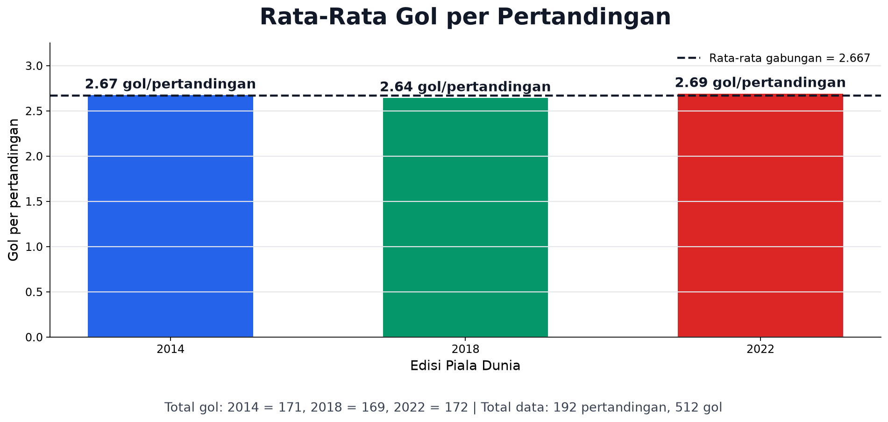
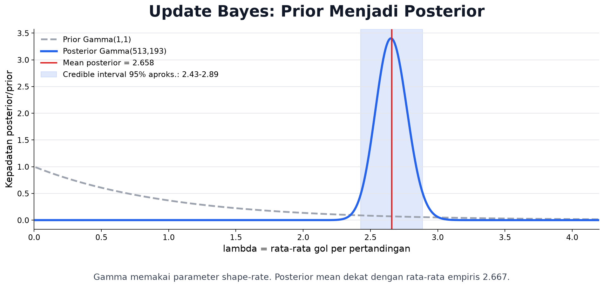
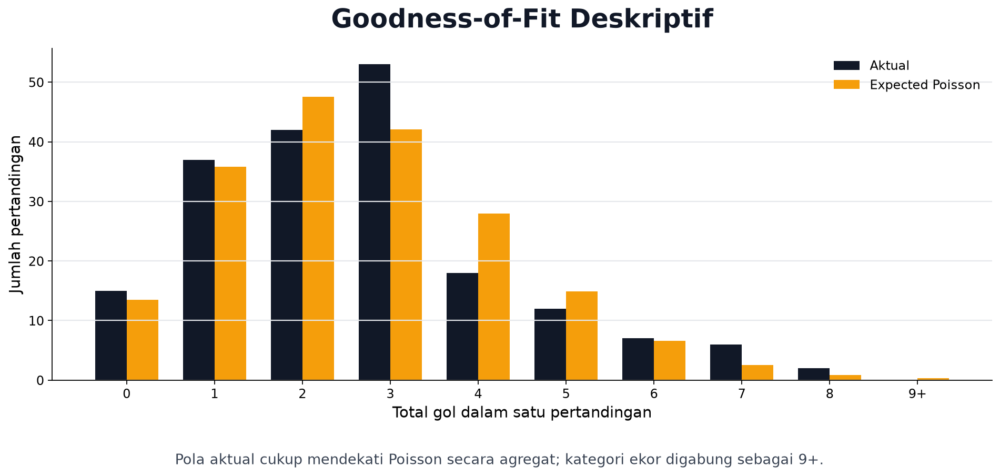
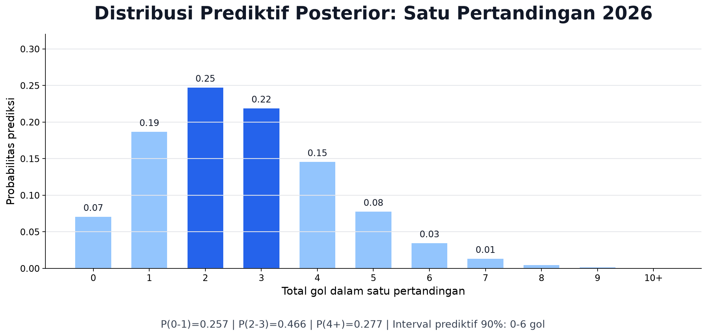

# SLIDE 1 - Judul

Model Bayesian Poisson untuk Gol Piala Dunia

By A and B

---

# SLIDE 2 - Overview

Analisis ini membahas jumlah gol per pertandingan Piala Dunia 2014, 2018, dan 2022.

Metode yang digunakan adalah Bayesian Poisson dengan prior Gamma.

Target akhir analisis adalah distribusi prediktif posterior untuk satu pertandingan Piala Dunia 2026.

Alur analisis:

1. Ambil data pertandingan Piala Dunia 2014, 2018, dan 2022.
2. Hitung total gol pada setiap pertandingan.
3. Modelkan total gol dengan distribusi Poisson.
4. Perbarui parameter rata-rata gol menggunakan prior Gamma.
5. Bandingkan frekuensi gol aktual dengan hasil model.
6. Gunakan posterior untuk memprediksi total gol pada satu pertandingan 2026.

---

# SLIDE 3 - Tujuan Analisis

Tujuan tugas ini adalah memodelkan total gol dalam satu pertandingan Piala Dunia sebagai data hitungan.

Fokus analisis:

- menghitung ringkasan gol dari data pertandingan;
- membangun model Poisson untuk total gol per pertandingan;
- memperbarui parameter rata-rata gol dengan pendekatan Bayes;
- mengecek goodness-of-fit secara deskriptif;
- membuat prediksi probabilistik untuk satu pertandingan 2026.

---

# SLIDE 4 - Pertanyaan Penelitian

Pertanyaan utama:

> Bagaimana model Bayesian Poisson dapat digunakan untuk memodelkan jumlah gol dalam satu pertandingan Piala Dunia?

Pertanyaan lanjutan:

> Berdasarkan Piala Dunia 2014, 2018, dan 2022, seperti apa distribusi prediktif posterior untuk jumlah gol pada satu pertandingan Piala Dunia 2026?

Model ini tidak memprediksi pemenang pertandingan. Yang diprediksi adalah total gol.

---

# SLIDE 5 - Konsep Singkat: Poisson dan Bayes

Poisson dipakai untuk data hitungan dalam satu interval tetap.

Dalam analisis ini:

```text
Y_i | lambda ~ Poisson(lambda)
```

Keterangan:

- `Y_i` = total gol pada pertandingan ke-i;
- `lambda` = rata-rata gol per pertandingan;
- nilai gol selalu 0, 1, 2, 3, dan seterusnya.

Bayes dipakai untuk memperbarui ketidakpastian:

```text
posterior proportional to likelihood x prior
```

---

# SLIDE 6 - Model

Model yang digunakan:

```text
Y_i | lambda ~ Poisson(lambda)
lambda ~ Gamma(1, 1)
```

Mengapa model ini cocok?

- gol adalah data hitungan;
- satu pertandingan memberi interval observasi yang jelas;
- tujuan analisis adalah rata-rata gol, bukan klasifikasi pemenang.

Mengapa prior Gamma?

- `lambda` harus positif;
- Gamma cocok untuk parameter rate;
- Gamma konjugat terhadap Poisson;
- hasil posterior tetap berbentuk Gamma, sehingga perhitungan rapi.

Jika total gol adalah `sum(y_i)` dan jumlah pertandingan adalah `n`, maka:

```text
lambda | data ~ Gamma(1 + sum(y_i), 1 + n)
```

---

# SLIDE 7 - Data

Data yang dipakai adalah pertandingan Piala Dunia 2014, 2018, dan 2022.

| Edisi | Pertandingan | Total gol | Rata-rata |
|---|---:|---:|---:|
| 2014 | 64 | 171 | 2.672 |
| 2018 | 64 | 169 | 2.641 |
| 2022 | 64 | 172 | 2.688 |

Ringkasan:

```text
n = 192 pertandingan
sum(y_i) = 512 gol
rata-rata empiris = 512 / 192 = 2.667
```



---

# SLIDE 8 - Hasil Posterior

Dengan prior `Gamma(1,1)` dan data 512 gol dari 192 pertandingan:

```text
lambda | data ~ Gamma(1 + 512, 1 + 192)
lambda | data ~ Gamma(513, 193)
```

Posterior mean:

```text
E[lambda | data] = 513 / 193 = 2.658
```

Interpretasi:

> Estimasi Bayesian untuk rata-rata gol adalah sekitar 2.658 gol per pertandingan.



---

# SLIDE 9 - Goodness-of-Fit

Goodness-of-fit dicek dengan membandingkan frekuensi aktual gol dan frekuensi yang diharapkan oleh model Poisson.

Ringkasan hasil notebook:

```text
Statistik chi-square deskriptif = 14.682
```

Interpretasi:

- pola aktual masih cukup dekat dengan pola Poisson;
- perbedaan terlihat pada beberapa jumlah gol tertentu;
- hasil ini dipakai sebagai pemeriksaan deskriptif, bukan bukti final bahwa model pasti benar.



---

# SLIDE 10 - Prediktif Posterior untuk 2026

Posterior `Gamma(513,193)` digunakan untuk memprediksi total gol pada satu pertandingan baru.

Dalam model Gamma-Poisson, distribusi prediktif posterior ekuivalen dengan Negative Binomial.

Hasil utama:

```text
P(0 sampai 1 gol)   = 0.257
P(2 sampai 3 gol)   = 0.466
P(4 gol atau lebih) = 0.277
Interval prediktif 90%: 0 sampai 6 gol
```



---

# SLIDE 11 - Interpretasi

Model memperkirakan pertandingan dengan 2 atau 3 gol sebagai hasil paling umum.

Namun, karena hasilnya berupa distribusi, model tetap memberi peluang untuk:

- pertandingan rendah gol, seperti 0 atau 1 gol;
- pertandingan sedang, seperti 2 atau 3 gol;
- pertandingan tinggi gol, yaitu 4 gol atau lebih.

Ini adalah prediksi probabilistik untuk satu pertandingan 2026, bukan prediksi total gol seluruh turnamen.

---

# SLIDE 12 - Keterbatasan

Model ini cocok sebagai model dasar untuk Mathematical and Statistical Foundations, tetapi masih sederhana.

Keterbatasan utama:

- semua pertandingan dianggap memiliki satu rata-rata gol yang sama;
- kekuatan masing-masing tim belum dimodelkan;
- fase grup dan fase gugur belum dibedakan;
- efek skor rendah seperti 0-0 dan 1-1 belum dikoreksi;
- format Piala Dunia 2026 berbeda karena jumlah tim dan pertandingan bertambah.

Pengembangan lanjutan dapat memakai model hierarkis atau model sepak bola seperti Maher dan Dixon-Coles.

---

# SLIDE 13 - Kesimpulan

Model Bayesian Poisson memberikan cara yang sederhana dan konsisten untuk memodelkan jumlah gol.

Kesimpulan analisis:

- Poisson sesuai untuk total gol karena gol adalah data hitungan;
- prior Gamma menjaga `lambda` tetap positif dan menghasilkan posterior konjugat;
- data 2014, 2018, dan 2022 menghasilkan posterior `Gamma(513,193)`;
- rata-rata posterior adalah 2.658 gol per pertandingan;
- distribusi prediktif posterior menunjukkan peluang terbesar ada pada 2 sampai 3 gol.

---

# SLIDE 14 - Sumber

Sumber teori:

- Stanford Encyclopedia of Philosophy, "Bayes' Theorem": https://plato.stanford.edu/entries/bayes-theorem/
- NIST/SEMATECH e-Handbook of Statistical Methods, "Poisson Distribution": https://www.itl.nist.gov/div898/handbook/eda/section3/eda366j.htm
- Gelman, A., et al. (2013). Bayesian Data Analysis, 3rd ed. Chapman & Hall/CRC: http://www.stat.columbia.edu/~gelman/book/
- Downey, A. B. (2020). Think Bayes, 2nd ed. O'Reilly Media: https://allendowney.github.io/ThinkBayes2/
- Maher, M. J. (1982). Modelling Association Football Scores. Statistica Neerlandica.
- Dixon, M. J., & Coles, S. G. (1997). Modelling Association Football Scores. Applied Statistics.

Sumber data:

- Dataset lokal proyek: `worldcup.json/2014`, `worldcup.json/2018`, dan `worldcup.json/2022`
- Notebook perhitungan: `notebooks/bayesian_poisson_worldcup.ipynb`
